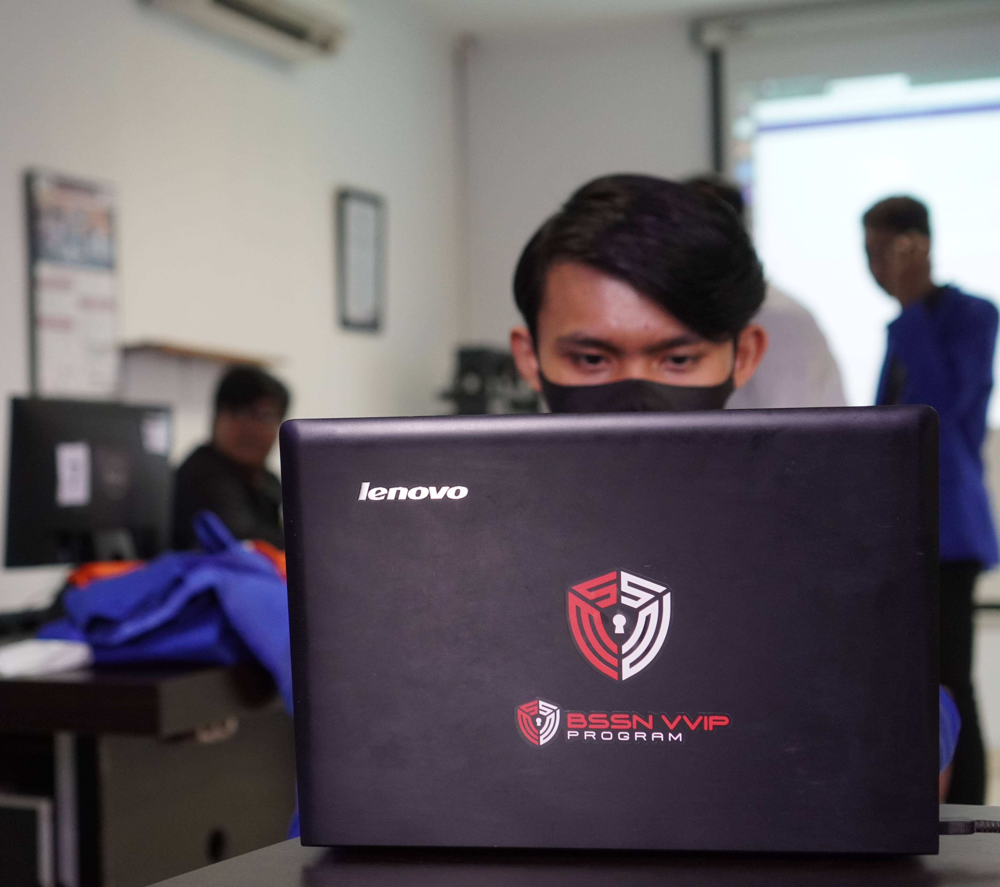

<h1 align="center"><a href="https://git.io/typing-svg"></a></h1>
<p></p><br>

- 🌱 I’m currently learning **Mobile and Back End Programming.**

- 👯 I’m looking to collaborate on **OpenSource Projects.**

- 📫 How to reach me **gdindra13@gmail.com**

<h3 align="left">🤙 Connect with me:</h3>
<p align="left">
<a href="https://www.linkedin.com/in/indrayyana" target="blank"></a>
<a href="https://www.facebook.com/profile.php?id=100017896938032&mibextid=ZbWKwL" target="blank"></a>
<a href="https://instagram.com/indrayyana" target="blank"></a>
</p>

<h3 align="left">💻 Languages and Tools:</h3>
<!-- <p align="left"> <a href="https://www.w3.org/html/" target="_blank" rel="noreferrer">  </a> <a href="https://www.w3schools.com/css/" target="_blank" rel="noreferrer">  </a> <a href="https://developer.mozilla.org/en-US/docs/Web/JavaScript" target="_blank" rel="noreferrer">  </a> <a href="https://www.php.net" target="_blank" rel="noreferrer">  </a> <a href="https://www.python.org" target="_blank" rel="noreferrer">  </a> <a href="https://www.djangoproject.com/" target="_blank" rel="noreferrer">  </a> <a href="https://nodejs.org" target="_blank" rel="noreferrer">  </a> <a href="https://dart.dev" target="_blank" rel="noreferrer">  </a> <a href="https://flutter.dev" target="_blank" rel="noreferrer">  </a> <a href="https://www.java.com" target="_blank" rel="noreferrer">  </a> <a href="https://www.w3schools.com/cpp/" target="_blank" rel="noreferrer">  </a> <a href="https://www.mysql.com/" target="_blank" rel="noreferrer">  </a> <a href="https://www.postgresql.org" target="_blank" rel="noreferrer">  </a> <a href="https://firebase.google.com/" target="_blank" rel="noreferrer">  </a> <a href="https://www.docker.com/" target="_blank" rel="noreferrer">  </a> <a href="https://git-scm.com/" target="_blank" rel="noreferrer">  </a> <a href="https://postman.com" target="_blank" rel="noreferrer">  </a> <a href="https://www.linux.org/" target="_blank" rel="noreferrer">  </a> </p> -->
<p> <a href="https://skillicons.dev"> </a> </p>

<a href="https://wakatime.com/@d2767603-e23e-49b9-84e8-252b6b99bb44"></a>

<a href="https://github.com/indrayyana/github-readme-stats"></a>

<!--START_SECTION:waka-->

```txt
From: 27 March 2023 - To: 22 May 2024

Total Time: 568 hrs 56 mins

Other             337 hrs 7 mins  █████████▒░░░░░░░░░░░░░░░   37.21 %
JavaScript        140 hrs 57 mins ████░░░░░░░░░░░░░░░░░░░░░   15.56 %
PHP               73 hrs 45 mins  ██░░░░░░░░░░░░░░░░░░░░░░░   08.14 %
Java              67 hrs 18 mins  ██░░░░░░░░░░░░░░░░░░░░░░░   07.43 %
CSS               46 hrs 41 mins  █▒░░░░░░░░░░░░░░░░░░░░░░░   05.15 %
```

<!--END_SECTION:waka-->

<details>
  <summary><h3>:zap: GitHub Stats</h3></summary>
  
| <a href="https://github.com/indrayyana/github-readme-stats"></a> | <a href="https://github.com/indrayyana/github-readme-stats"></a> |
| ------------- | ------------- |
</details> 

<h3 align="center">🐍 My Contributions 🐍</h3>
<p></p>

<h3 align="center"><a href="https://git.io/typing-svg"></a></h3>
